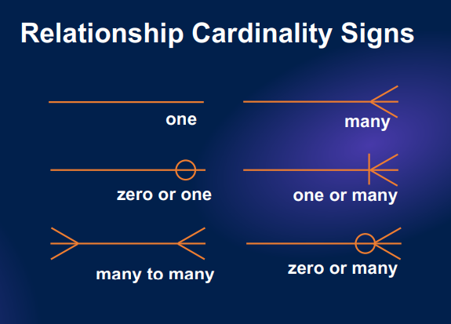
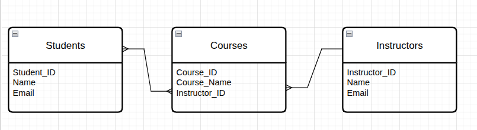
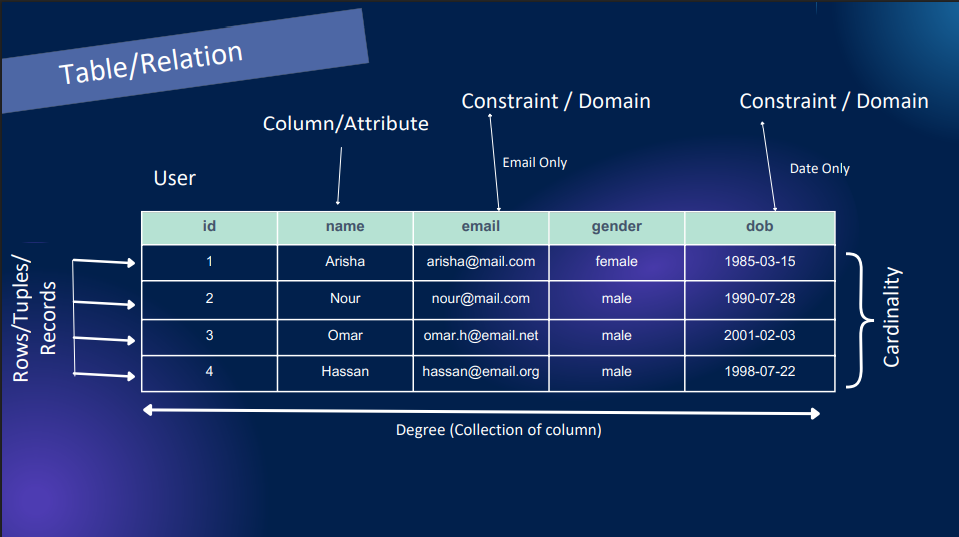

<h1 align="center">Database Management Systems Notes</h1>

- [Introduction](#introduction)
    - [Problem with traditional file systems:](#problem-with-traditional-file-systems)
    - [Most Common Types of DBMS:](#most-common-types-of-dbms)
    - [DBMS Architecture:](#dbms-architecture)
    - [Software Development Life Cycle (SDLC):](#software-development-life-cycle-sdlc)
    - [Database Design:](#database-design)
    - [Relationship Cardinality:](#relationship-cardinality)
    - [Relationship Cardinality Signs:](#relationship-cardinality-signs)
    - [Entity-Relationship (ER) Diagram:](#entity-relationship-er-diagram)
      - [Example 1:](#example-1)
- [Relational Database Management System](#relational-database-management-system)
    - [Schemas, Instance and Entities:](#schemas-instance-and-entities)
    - [Table in RDBMS::](#table-in-rdbms)
    - [keys in RDBMS:](#keys-in-rdbms)
      - [Super Key:](#super-key)
      - [Candidate key:](#candidate-key)
      - [Primary key:](#primary-key)
      - [Alternate key:](#alternate-key)
      - [Composite key:](#composite-key)
      - [Foreign key:](#foreign-key)
- [Database Normalization](#database-normalization)
    - [Anomalies:](#anomalies)
    - [Normalization:](#normalization)
      - [Functional Dependencies:](#functional-dependencies)
      - [Normal Forms:](#normal-forms)
      - [Example of Normalization:](#example-of-normalization)

# Introduction
A Database Management System (DBMS) is a software system that allows us to manage data through databases. It acts as a bridge between the database and users or applications.

Note: 
- Data: Raw, unprocessed facts: 85, 90, 88, 92, 87
- Information: Processed data: Calculate the average temperature: sum of data / 5 = 88.4 (Information)
- Database: Organized collection of data

### Problem with traditional file systems:
Before the introduction of modern DBMS, data was managed using basic file systems on hard drives. While this approach allowed us to manage files as needed, but it came with numerous challenges such as: 
- Data Redundancy and inconsistency
- Difficult in Accessing the data
- Poor Security
- No support for collaboration
- No Backup/Recovery
  
### Most Common Types of DBMS: 

1. Relational Database Management System (RDBMS):
   - Data is organized in tables (relations) with rows and columns.
   - Uses Structured Query Language (SQL).
   - Examples: Oracle, MySQL, Microsoft SQL Server, PostgreSQL etc.
2. Non-Relational Database Management System (NoSQL DBMS):
   - Data is stored in a non-tabular(unstructured, flexible) format (key-value pairs, JSON-like documents, graphs etc).
   - Examples: MongoDB, Redis, Amazon DynamoDB etc.

### DBMS Architecture: 
- 1-Tier Architecture: Client and database are part of the same local system and this architecture don't have application server.
  - client + database
  - Example: MS Excel, MS Access etc.
  
- 2-Tier Architecture: Client and database are on separate systems and this architecture also don't have application server.
  - client --> database
  - Example: Desktop App → MySQL, Desktop App → SQL

- 3-Tier Architecture: The client communicates with an application server, which then communicates with the database. Here every component are separated.
  - client --> application server --> database
  - Example: Web app (React) → Node/Express → MongoDB

**Tips:** 1-Tier = all in one, 2-Tier = client + DB, 3-Tier = client + server + DB

### Software Development Life Cycle (SDLC):
Planning -> Analysis -> System Design (Frontend, Backend, Database etc) -> Implementation (Building) -> Testing -> Maintenance (Deployment)

### Database Design: 
- Determining Entities (Students, Courses, Grades etc)
- Determining Attributes for each entities (Student_ID, Email, Phone etc)
- Determining Relationships between entities (Relationship Cardinality)
- Resolving Many to Many relationships

### Relationship Cardinality:
Relationship cardinality defines how many instances of one entity can be associated with how many instances of another entity in a database relationship.

Types of Relationship Cardinality: 

- One-to-One (1:1)
  - One record in Entity A is related to only one record in Entity B.
  - One student has one student ID.
  
- One-to-Many (1:N)
  - One record in Entity A can be related to many records in Entity B, but Entity B relates to only one record in A.
  - One student can enroll in many courses, but each course belongs to one student.

- Many-to-One (N:1)
  - Many records in Entity A can be related to one record in Entity B, but Entity B relates to many records in A.
  - Many students can enroll in-one course, but each student belongs to one course

- Many-to-Many (M:N)
  - Many records in Entity A can be related to many records in Entity B.
  - A student can enroll in many courses, and a course can have many students.

### Relationship Cardinality Signs: 



### Entity-Relationship (ER) Diagram:
Entity-Relationship Diagram is a visual representation of entities, their attributes, and the relationships between them in a database system.

#### Example 1:
Business idea: EduHub is a global website offering a variety of technology courses across different subjects, allowing students to enroll and learn

Database Design: 
- Determining Entities:
Students, Courses, Instructors

- Determining Attributes for each entities (Student_ID, Email, Phone etc)
  - for Students Entity: Student_ID, Name, Email
  - for Courses Entity: Course_ID, Course_Name, Instructor_ID
  - for Instructors Entity: Instructor_ID, Name, Email



- Resolving Many to Many relationships using junction table:


Explanation of Relationships:

Students to Enrollment: One-to-Many (1 student : many enrollments)
Courses to Enrollment: One-to-Many (1 course : many enrollments)
Instructor to courses: One-to-Many (1 instructor : many courses)


# Relational Database Management System

### Schemas, Instance and Entities:

**Schemas** is the logical structure or blueprint of the database that defines tables, attributes, relationships, constraints etc. It changes rarely. 

```sql
CREATE TABLE students (
    student_id SERIAL PRIMARY KEY,
    email      VARCHAR(255) UNIQUE NOT NULL,
    phone      VARCHAR(20)
);
```

**Instance** is the actual data (rows) stored in the database according to the schemas at a specific time. It changes frequently.

| Student_ID | Email           | Phone        |
| ---------- | --------------- | ------------ |
| 1          | test1@gmail.com | 123-456-789  |
| 2          | test2@gmail.com | 123-456-7890 |
| 3          | test3@gmail.com | 123-456-7891 |

**Entities** are the different types of tables in the database.

| Student_ID | Email           | Phone        |
| ---------- | --------------- | ------------ |
| 1          | test1@gmail.com | 123-456-789  |
| 2          | test2@gmail.com | 123-456-7890 |
| 3          | test3@gmail.com | 123-456-7891 |

here, full students table is an entity.

### Table in RDBMS:: 


### keys in RDBMS:
A key is an attribute (or a set of attributes) used to uniquely identify a row (tuple) in a table and to establish relationships between tables.

| Student_ID | Email           | Phone        |
| ---------- | --------------- | ------------ |
| 1          | test1@gmail.com | 123-456-789  |
| 2          | test2@gmail.com | 123-456-7890 |
| 3          | test3@gmail.com | 123-456-7891 |

#### Super Key: 
A Super Key is any attribute or set of attributes that can uniquely identify a record in a table.

In the above table, the possible super keys: 
- {Student_ID}
- {Email}
- {phone}
- {Student_ID, Email}
- {Student_ID, Phone}

#### Candidate key: 
A Candidate Key is a minimal super key.

In the above table, the candidate keys are: 
- {Student_ID}
- {Email}

Note: {Student_ID, Email} is a super key but not a candidate key because Student_ID and Email both alone can uniquely identify a record.

#### Primary key: 
A Primary Key is a candidate key that are:
- Cannot be NULL
- Must be unique
- Only one per table.

In the above table, the primary key are: 
- Student_ID

#### Alternate key: 
All candidate keys that are NOT chosen as the primary key are called Alternate Keys.

In the above table, the alternate keys are: 
- Email

Note: Since Student_ID is the primary key, so in the table then Email is the alternate key.

#### Composite key: 
A Composite Key is a candidate key that made of two or more attributes that together uniquely identify a record.

Grade Table:

| Grade_id | Student_ID | Course_ID | Grade |
| -------- | ---------- | --------- | ----- |
| 1        | 1          | CS101     | A     |
| 2        | 2          | CS101     | A     |
| 3        | 3          | CS101     | A     |
| 4        | 1          | CS102     | A     |
| 5        | 1          | CS103     | A     |
| 6        | 2          | CS103     | A     |

here, the candidate keys are: 
- {Student_ID, Course_ID}

#### Foreign key:  
A Foreign Key is an attribute in one table that refers to the primary key of another table. It establishes relationships between tables.

In the Grade Table table, the foreign keys are:
- {Student_ID} 


# Database Normalization

### Anomalies:
Anomalies are data inconsistencies that occur in a database due to poor table design, especially when a table is not properly normalized.

| Student_ID | Student_Name | Course_ID | Course_Name | Teacher   |
| ---------- | ------------ | --------- | ----------- | --------- |
| 1          | Rahim        | C101      | DBMS        | Mr. Karim |
| 1          | Rahim        | C102      | OS          | Mr. Hasan |
| 2          | Karim        | C101      | DBMS        | Mr. Karim |

There are three main types of anomalies:

- Insertion Anomaly:
Insertion Anomaly occurs when you cannot insert data into a table without inserting some other unrelated data.

Problem: 
You want to add a new Course (C103, Networking, Mr. Alam) but you cannot do that without adding a student.

- Update Anomaly
Update Anomaly occurs when updating one piece of data requires updating multiple rows, and missing one causes inconsistency.

Problem: 
Suppose Mr. Karim changes his name to Mr. k. Karim, then you must update every row where Mr. Karim is mentioned. If you miss one, it leads to inconsistency.

- Deletion Anomaly:
Deletion Anomaly occurs when deleting one record unintentionally deletes important related data.

Problem: 
Suppose, student Rahim decides to drop 1 course (C101, DBMS). If you delete that row, you also lose all information about the course DBMS and its teacher Mr. Karim if no other student is enrolled in that course.

To resolve these anomalies, we can normalize the database by splitting the table into multiple related tables.

Student Table:
| Student_ID | Student_Name |
| ---------- | ------------ |
| 1          | Rahim        |
| 2          | Karim        |

Course Table: 
| Course_ID | Course_Name | Teacher   |
| --------- | ----------- | --------- |
| C101      | DBMS        | Mr. Karim |
| C102      | OS          | Mr. Hasan |

Enrollment Table: 
| Enrollment_ID | Student_ID | Course_ID |
| ------------- | ---------- | --------- |
| 1             | 1          | C101      |
| 2             | 1          | C102      |
| 3             | 2          | C101      |

### Normalization: 
Normalization is the process of organizing data in a database using normal forms to reduce redundancy and anomalies. Normalization works by splitting large, poorly designed tables into smaller, well-structured tables and defining proper relationships.

#### Functional Dependencies:
functional dependency is a relationship that exists when one attribute uniquely determines another attribute.

| Student_ID | Student_Name | gender |
| ---------- | ------------ | ------ |
| 1          | Rahim        | Male   |
| 2          | Karim        | Male   |

for example, here if we know the Student_ID, we can uniquely determine the Student_Name and gender. So, we can say that Student_ID functionally determines Student_Name and gender.

But if we know the Student_Name or gender we cannot uniquely determine the Student_ID because multiple students can have the same name and gender.

we can achieve normalization through functional dependencies using the Normal Forms (1NF, 2NF, 3NF etc).

#### Normal Forms:
Normal forms are a set of rules or guidelines used to evaluate and organize database tables based on functional dependencies.

- 1NF (First Normal Form):
A table is in 1NF if: 
  - It contains only atomic values attribute means a single value that cannot be further divided. 
    - 01711, 01822 (Not atomic) -> 01711 (atomic), 01822 (atomic)
    - Dhaka, Bangladesh, 1212 (Not atomic) -> Dhaka (atomic), Bangladesh (atomic), 1212 (atomic)
  - Each record can be uniquely identified by a primary key
 
- 2NF (Second Normal Form)
A table is in 2NF if: 
  - It is already in 1NF
  - No partial dependency exists 
    - Partial dependency occurs when a non-key attribute is functionally dependent on a part of a composite key.
 
- 3NF (Third Normal Form)
A table is in 3NF if: 
  - It is already in 2NF
  - No transitive dependency exists
    - Transitive dependency occurs when a non-key attribute is functionally dependent on another non-key attribute.

#### Example of Normalization:

| StudentID | StudentName | CourseID | CourseName | TeacherName  |
| --------- | ----------- | -------- | ---------- | ------------ |
| 1         | Rahim       | C1, C2   | DBMS, OS   | Karim, Hasan |
| 2         | Karim       | C1       | DBMS       | Karim        |


step 1: Convert to 1NF:
- Atomic values only

| StudentID | StudentName | CourseID | CourseName | TeacherName |
| --------- | ----------- | -------- | ---------- | ----------- |
| 1         | Rahim       | C1       | DBMS       | Karim       |
| 1         | Rahim       | C2       | OS         | Hasan       |
| 2         | Karim       | C1       | DBMS       | Karim       |

step 2: Convert ot 2NF:
- Remove partial dependencies

Students table:
| StudentID | StudentName |
| --------- | ----------- |
| 1         | Rahim       |
| 2         | Karim       |

Courses table:
| CourseID | CourseName | TeacherName |
| -------- | ---------- | ----------- |
| C1       | DBMS       | Karim       |
| C2       | OS         | Hasan       |


Enrollments table:
| StudentID | CourseID |
| --------- | -------- |
| 1         | C1       |
| 1         | C2       |
| 2         | C1       |


step 3: Convert to 3NF:
- Remove transitive dependencies

Students table: 
| StudentID | StudentName |
| --------- | ----------- |
| 1         | Rahim       |
| 2         | Karim       |


Teachers Table: 
| TeacherID | TeacherName |
| --------- | ----------- |
| T1        | Karim       |
| T2        | Hasan       |


Courses table: 
| CourseID | CourseName | TeacherID |
| -------- | ---------- | --------- |
| C1       | DBMS       | T1        |
| C2       | OS         | T2        |

Enrollments table: 
| StudentID | CourseID |
| --------- | -------- |
| 1         | C1       |
| 1         | C2       |
| 2         | C1       |
