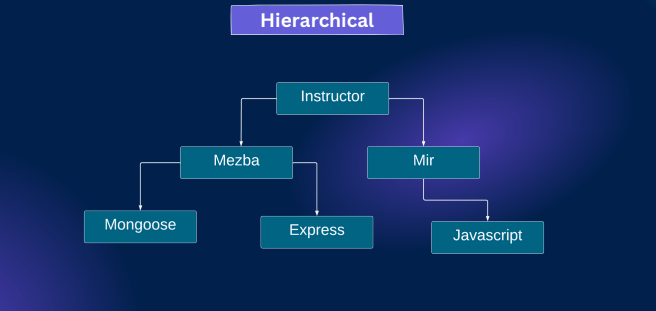
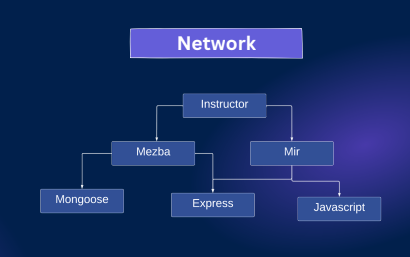
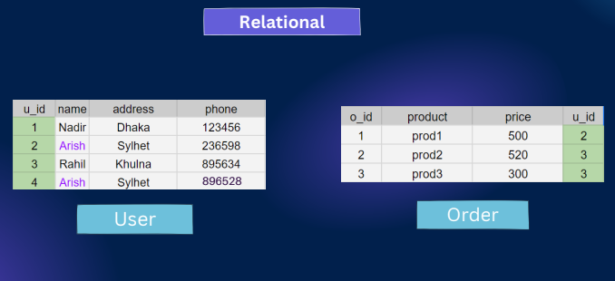
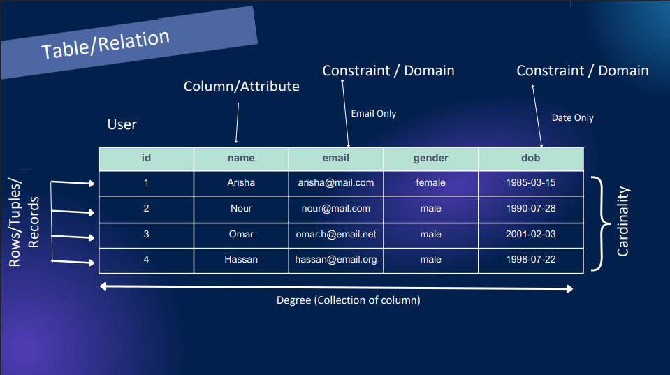
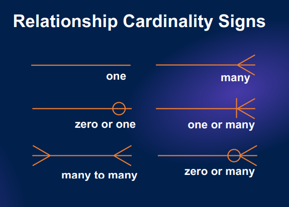
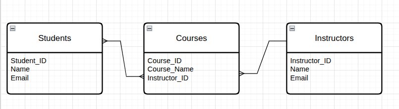
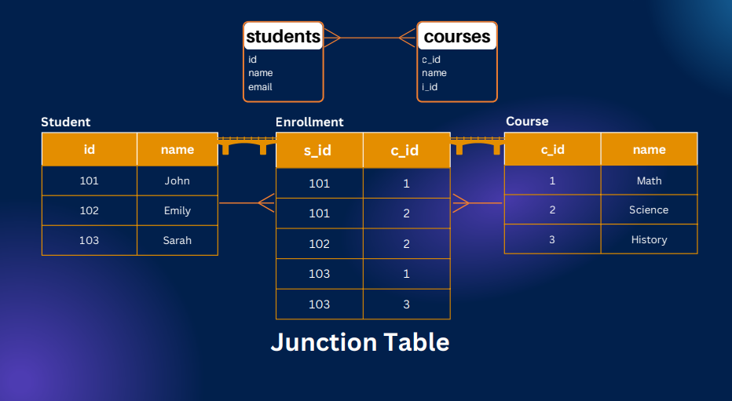
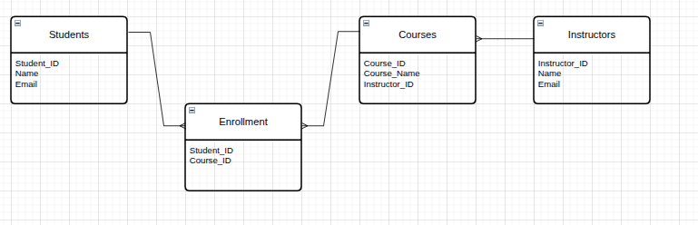

<h1 align="center">Database Management Systems Notes</h1>

**Note:** Most DBMS concepts are based on **Relational Database Management Systems (RDBMS)**. 

- [1. Introduction](#1-introduction)
  - [1.1. What is DBMS:](#11-what-is-dbms)
  - [1.2. Difference Between DBMS and Database:](#12-difference-between-dbms-and-database)
  - [1.3. Why we Need DBMS:](#13-why-we-need-dbms)
  - [1.4. Types of DBMS Model:](#14-types-of-dbms-model)
  - [1.5. Most Common Types of DBMS:](#15-most-common-types-of-dbms)
  - [1.6. PostgreSQL vs MySQL Vs MongoDB:](#16-postgresql-vs-mysql-vs-mongodb)
  - [1.7. SQL VS NoSQL:](#17-sql-vs-nosql)
  - [1.8. DBMS Architecture:](#18-dbms-architecture)
  - [1.9. Schema vs CRUD vs Query:](#19-schema-vs-crud-vs-query)
- [2. RDBMS Core Concepts:](#2-rdbms-core-concepts)
  - [2.1. keys:](#21-keys)
    - [2.1.1. Primary Key (PK):](#211-primary-key-pk)
    - [2.1.2. Foreign Key (FK):](#212-foreign-key-fk)
    - [2.1.3. Super Key:](#213-super-key)
    - [2.1.4. Candidate Key:](#214-candidate-key)
    - [2.1.5. Alternate Key:](#215-alternate-key)
    - [2.1.6. Composite Key (Compound Key):](#216-composite-key-compound-key)
    - [2.1.7. Unique Key:](#217-unique-key)
- [3. Anomalies:](#3-anomalies)
- [4. Database Normalization](#4-database-normalization)
  - [4.1. Normal Forms:](#41-normal-forms)
    - [4.1.1. 1NF (First Normal Form):](#411-1nf-first-normal-form)
    - [4.1.2. 2NF (Second Normal Form)](#412-2nf-second-normal-form)
    - [4.1.3. 3NF (Third Normal Form)](#413-3nf-third-normal-form)
  - [4.2. Dependency:](#42-dependency)
    - [4.2.1. Functional Dependency:](#421-functional-dependency)
    - [4.2.2. Partial Dependency:](#422-partial-dependency)
    - [4.2.3. Transitive Dependency:](#423-transitive-dependency)
  - [4.3. Example of Normalization:](#43-example-of-normalization)
- [5. Entity Relationship Diagram (ERD):](#5-entity-relationship-diagram-erd)
  - [5.1. Relationship Cardinality:](#51-relationship-cardinality)
    - [5.1.1. Types of Relationship Cardinality](#511-types-of-relationship-cardinality)
      - [5.1.1.1. One-to-One (1:1):](#5111-one-to-one-11)
      - [5.1.1.2. One-to-Many (1:N):](#5112-one-to-many-1n)
      - [5.1.1.3. Many-to-One (N:1):](#5113-many-to-one-n1)
      - [5.1.1.4. Many-to-Many (M:N):](#5114-many-to-many-mn)
  - [5.2. Relationship Cardinality Signs:](#52-relationship-cardinality-signs)
  - [5.3. Example:](#53-example)

# 1. Introduction

## 1.1. What is DBMS:
A DBMS (Database Management System) is a software system that allows us to manage data in databases efficiently.

## 1.2. Difference Between DBMS and Database: 
- Databases: A database is an electronic storage system where an organized collection of data is stored.
- DBMS: DBMS is a software system that allows us to manage data in databases efficiently like MySQL, PostgreSQL, MongoDB

## 1.3. Why we Need DBMS:
Before the introduction of modern DBMS, data was managed using basic traditional file systems on hard drives. While this approach allowed us to manage files as needed, but it came with numerous challenges such as: 
- Data Redundancy (duplicated data) and inconsistency 
- Difficult in Accessing the data
- Poor Security
- No support for collaboration
- No Backup/Recovery

## 1.4. Types of DBMS Model: 
- Hierarchical Model: 
  - What it is: Tree structure (parent → child)
  - Problem: No many-to-many (child can’t have multiple parents) 



- Network Model: 
  - What it is: Graph-like (many-to-many supported)
  - Problem: Too complex to design & query



- Relational Model: 
  - What it is: Tables (rows + columns), uses SQL
  - Problem: hard to handle flexible and nested data  



- Document Model: 
  - What it is: JSON-like flexible documents
  - Problem: Data duplication, weak relationships

```js
// users collection
[
  {
    _id: 1,
    name: "Nadir",
    address: "Dhaka",
    phone: "123456",
    orders: []
  },
  {
    _id: 2,
    name: "Arish",
    address: "Sylhet",
    phone: "236598",
    orders: [
      {
        o_id: 1,
        product: "prod1",
        price: 500
      }
    ]
  },
]
```


## 1.5. Most Common Types of DBMS: 

1. Relational Database Management System (RDBMS):
   - Data is organized in tables (relations) with rows and columns.
   - Uses Structured Query Language (SQL).
   - Examples: MySQL, PostgreSQL, Oracle, Microsoft SQL Server etc.
2. Non-Relational Database Management System (NoSQL DBMS):
   - Data is stored in a non-tabular(unstructured, flexible) format (key-value pairs, JSON-like documents, graphs etc).
   - Examples: MongoDB, Redis, Amazon DynamoDB etc.


## 1.6. PostgreSQL vs MySQL Vs MongoDB: 
| Feature        | PostgreSQL                     | MySQL                   | MongoDB                |
| -------------- | ------------------------------ | ----------------------- | ---------------------- |
| Type           | Relational (RDBMS)             | Relational (RDBMS)      | Document-based         |
| Schema         | Strict (but flexible via JSON) | Strict                  | Schema-less            |
| Query Language | SQL (advanced)                 | SQL (simpler)           | N/A                    |
| Transactions   | Full ACID support              | ACID (less advanced)    | Limited (improving)    |
| Relationships  | Strong (JOINs, FK)             | Supported               | Weak / manual          |
| JSON Support   | Yes (JSONB, powerful)          | Limited                 | Native                 |
| Performance    | Best for complex queries       | Fast for simple queries | Best for flexible data |

## 1.7. SQL VS NoSQL:
In the context of MongoDB, a document is basically a single record in a collection, similar to a row in a SQL database.

```
SQL                      MongoDB
------------------       -------------------
Database                 Database
  └── Table                └── Collection
        └── Row                  └── Document
              └── Column               └── Field
```


SQL:
```
Users Table
-----------
id | name | email
```

MongoDB:
```
{
  "_id": "123",
  "name": "John",
  "email": "john@example.com"
}
```


| Feature       | SQL (Relational DB)     | NoSQL (MongoDB)         |
| ------------- | ----------------------- | ----------------------- |
| Structure     | Tables (rows & columns) | Collections (documents) |
| Schema        | Fixed                   | Flexible                |
| Relationships | Strong (JOINs)          | Weak / manual           |


## 1.8. DBMS Architecture: 
- 1-Tier Architecture: Client and database are part of the same local system and this architecture don't have application server.
  - client + database
  - Example: MS Excel, MS Access etc.
  
- 2-Tier Architecture: Client and database are on separate systems and this architecture also don't have application server.
  - client --> database
  - Example: Desktop App → MySQL, Desktop App → SQL

- 3-Tier Architecture: The client communicates with an application server, which then communicates with the database. Here every component are separated.
  - client --> application server --> database
  - Example: Web app (React) → Node/Express → MongoDB

**Tips:** 1-Tier = all in one, 2-Tier = client + DB, 3-Tier = client + server + DB

## 1.9. Schema vs CRUD vs Query: 
- Schema: Defines the structure of the data.
- CRUD: Types of Database Operations (Create, Read, Update, Delete) 
- Query: Any command/request sent to the database.

Note: 
- CRUD = What you want to do
- Query = The command used to do it

```sql
-- schema
CREATE TABLE users (
    id SERIAL PRIMARY KEY,
    name VARCHAR(100) NOT NULL,
    email TEXT UNIQUE NOT NULL,
    age INT CHECK (age >= 0),
    created_at TIMESTAMP DEFAULT NOW()
);
```

```js
// CRUD Operation
app.post("/users", async (req: Request, res: Response) => {
    const { name, email, age } = req.body;

    const result = await pool.query(
      `INSERT INTO users (name, email, age) VALUES ($1, $2, $3) RETURNING *`, [name, email, age]); // Query

    res.send(result.rows[0])
});
```


# 2. RDBMS Core Concepts:
RDBMS (Relational Database Management System) is a type of database management system that stores data in a structured format using tables (relations).



- Entity: Is a real-world object or concept that we store data about. In the image above, the users table represents the User entity. So, in this table we can say users entity or users table.
- Column/attribute/field: A column defines what kind of data is stored.
- Row/Tuple/Record: A row is a single entry of data.
- Degree: Total number of columns in a table
- Cardinality: Total number of rows in a table

## 2.1. keys:
A key is a column or a set of columns used to uniquely identify a row in a table and establish relationships between tables.

### 2.1.1. Primary Key (PK): 
A Primary Key uniquely identifies each row in a table. A Primary Key:
- Must be unique
- Cannot be NULL
- Only one primary key per table

```sql
CREATE TABLE users (
    id INT PRIMARY KEY,
    name VARCHAR(100)
)
```

so here id is primary key.

### 2.1.2. Foreign Key (FK):
A Foreign Key creates a relationship between two tables.

```sql
CREATE TABLE users (
    id INT PRIMARY KEY,
    name VARCHAR(100)
);

CREATE TABLE orders (
    id INT PRIMARY KEY,
    user_id INT,
    FOREIGN KEY (user_id) REFERENCES users(id)
);
```

### 2.1.3. Super Key:
A Super Key is any column or set of columns that uniquely identifies a row.

```sql
CREATE TABLE users (
    id INT PRIMARY KEY,
    email VARCHAR(255) UNIQUE,
    username VARCHAR(50) UNIQUE,
);
```

all super keys: 

```
(id)
(email)
(username)

(id, email)
(id, username)
(email, username)

(id, email, username)
```


### 2.1.4. Candidate Key: 
A Candidate Key is a minimal Super Key. 

```sql
CREATE TABLE users (
    id INT PRIMARY KEY,
    email VARCHAR(255) UNIQUE,
    username VARCHAR(50) UNIQUE,
);
```

here super keys are: 

```
(id)
(email)
(username)

(id, email)
(id, username)
(email, username)

(id, email, username)
```

but candidate keys are:

```
(id)
(email)
(username)
```

Just think id, email and username all can uniquely identify a record alone, thats why they are candidate keys.


### 2.1.5. Alternate Key:
An Alternate Key is a Candidate Key that was not chosen as the Primary Key.

```sql
CREATE TABLE users (
    id INT PRIMARY KEY,
    email VARCHAR(255) UNIQUE,
    username VARCHAR(50) UNIQUE
);
```

if id is a primary key then email and username are alternate keys.

### 2.1.6. Composite Key (Compound Key):
A Composite Key is a key that made up of two or more columns for uniquely identify a row.

```sql
CREATE TABLE enrollments (
    student_id INT,
    course_id INT,
    FOREIGN KEY (student_id) REFERENCES students(id),
    FOREIGN KEY (course_id) REFERENCES courses(id),
    enrollment_id PRIMARY KEY (student_id, course_id)
);
```

| enrollment_id | student_id | course_id |
| ------------- | ---------- | --------- |
| 1101          | 1          | 101       |
| 1102          | 1          | 102       |

Neither column is unique alone, but together they are. So thats why student_id and course_id together made a composite key.called enrollment_id

### 2.1.7. Unique Key: 
A Unique Key ensures all values are unique.

```sql
CREATE TABLE users (
    id INT PRIMARY KEY,
    email VARCHAR(255) UNIQUE,
    username VARCHAR(50) UNIQUE,
);
```

here email and username are unique keys.


# 3. Anomalies:
Anomalies are data inconsistencies that occur in a database due to poor table design, especially when a table is not properly normalized.

There are three main types of anomalies:

1. Insertion Anomaly: Occurs when inserting one piece of data requires inserting some other unrelated data.
2. Update Anomaly: Occurs when updating one piece of data requires updating multiple rows of the same data.
3. Deletion Anomaly: Deletion Anomaly occurs when deleting one data unintentionally deletes others related data.

example: 

| Student_ID | Student_Name | Course_ID | Course_Name | Teacher   |
| ---------- | ------------ | --------- | ----------- | --------- |
| 1          | Rahim        | C101      | DBMS        | Mr. Karim |
| 1          | Rahim        | C102      | OS          | Mr. Hasan |
| 2          | Karim        | C101      | DBMS        | Mr. Karim |

here, 
- Insertion Anomaly: Suppose, If we want to add a new Course like (C103, Networking, Mr. Alam) then we cannot do that without adding a student.
- Update Anomaly: Suppose, Mr. Karim changes his name to Mr. k. Karim, then we must update every row where Mr. Karim is mentioned. If we miss one, it leads to inconsistency.
- Deletion Anomaly: Suppose, student Rahim decides to drop 1 course (C101, DBMS). If we delete that row, we also lose all information about the course DBMS and its teacher Mr. Karim if no other student is enrolled in that course.

To resolve these anomalies, we can normalize the database by splitting the table into multiple related tables.

Student Table:
| Student_ID | Student_Name |
| ---------- | ------------ |
| 1          | Rahim        |
| 2          | Karim        |

Course Table: 
| Course_ID | Course_Name | Teacher   |
| --------- | ----------- | --------- |
| C101      | DBMS        | Mr. Karim |
| C102      | OS          | Mr. Hasan |

Enrollment Table: 
| Enrollment_ID | Student_ID | Course_ID |
| ------------- | ---------- | --------- |
| 1             | 1          | C101      |
| 2             | 1          | C102      |
| 3             | 2          | C101      |


# 4. Database Normalization
Normalization is the process of organizing data in a database using normal forms to reduce redundancy(duplicated data) and anomalies. Normalization works by splitting large, poorly designed tables into smaller, well-structured tables and defining proper relationships.

## 4.1. Normal Forms:
Normal Forms are a set of rules used in database normalization to organize data and reduce redundancy (duplicated data), inconsistency, and anomalies.

### 4.1.1. 1NF (First Normal Form):
A table is in 1NF if: 
- Each cell must contain atomic (single) values. 
- Each row can be uniquely identified by a primary key

### 4.1.2. 2NF (Second Normal Form)
A table is in 2NF if: 
- It is already in 1NF
- No partial dependency exists 
  - Partial dependency occurs when a non-key attribute is functionally dependent on a part of a composite key instead of the whole composite key.
 
### 4.1.3. 3NF (Third Normal Form)
A table is in 3NF if: 
- It is already in 2NF
- No transitive dependency exists
  - A Transitive Dependency occurs when a non-key attribute functionally depends on another non-key attribute instead of depending directly on the primary key.

## 4.2. Dependency:

### 4.2.1. Functional Dependency:
A column B is functionally dependent on column A if each value of A determines exactly one value of B.

| student_id | student_name |
| ---------- | ------------ |
| 1          | Tamim        |
| 2          | John         |
| 3          | Alice        |

here, student_name is functionally dependent on student_id because each value of student_id determines exactly one value of student_name. So if I know the student_id, I can determine the student_name because: 

```
1 always means Tamim
2 always means John
3 always means Alice
```

### 4.2.2. Partial Dependency:
Partial dependency occurs when a non-key attribute is functionally dependent on a part of a composite key instead of the whole composite key.

| student_id | course_id | student_name | course_name |
| ---------- | --------- | ------------ | ----------- |
| 1          | C101      | Tamim        | Database    |
| 2          | C101      | John         | Database    |


Suppose the primary key is `(student_id, course_id)`. This is a composite key. Now if we want to determine the student_name, course_name we don't need the full composite key. Because student_id can determine student_name and course_id can determine course_name. So we can say that student_name is partial dependent on student_id and course_name is partial dependent on course_id. 

### 4.2.3. Transitive Dependency:
A Transitive Dependency occurs when a non-key attribute functionally depends on another non-key attribute instead of depending directly on the primary key.

| employee_id | department_id | department_name |
| ----------- | ------------- | --------------- |
| 1           | D1            | Engineering     |
| 2           | D2            | Marketing       |


here, department_name depends on department_id and department_id depends on employee_id. So we can say that employee_id is transitive dependent on department_id and department_id is transitive dependent on department_name.


## 4.3. Example of Normalization:

| StudentID | StudentName | CourseID | CourseName | TeacherName  |
| --------- | ----------- | -------- | ---------- | ------------ |
| 1         | Rahim       | C1, C2   | DBMS, OS   | Karim, Hasan |
| 2         | Karim       | C1       | DBMS       | Karim        |


step 1: Convert to 1NF:
- Atomic values only

| StudentID | StudentName | CourseID | CourseName | TeacherName |
| --------- | ----------- | -------- | ---------- | ----------- |
| 1         | Rahim       | C1       | DBMS       | Karim       |
| 1         | Rahim       | C2       | OS         | Hasan       |
| 2         | Karim       | C1       | DBMS       | Karim       |

step 2: Convert ot 2NF:
- Remove partial dependencies

Students table:
| StudentID | StudentName |
| --------- | ----------- |
| 1         | Rahim       |
| 2         | Karim       |

Courses table:
| CourseID | CourseName | TeacherName |
| -------- | ---------- | ----------- |
| C1       | DBMS       | Karim       |
| C2       | OS         | Hasan       |


Enrollments table:
| StudentID | CourseID |
| --------- | -------- |
| 1         | C1       |
| 1         | C2       |
| 2         | C1       |


step 3: Convert to 3NF:
- Remove transitive dependencies

Students table: 
| StudentID | StudentName |
| --------- | ----------- |
| 1         | Rahim       |
| 2         | Karim       |


Teachers Table: 
| TeacherID | TeacherName |
| --------- | ----------- |
| T1        | Karim       |
| T2        | Hasan       |


Courses table: 
| CourseID | CourseName | TeacherID |
| -------- | ---------- | --------- |
| C1       | DBMS       | T1        |
| C2       | OS         | T2        |

Enrollments table: 
| StudentID | CourseID |
| --------- | -------- |
| 1         | C1       |
| 1         | C2       |
| 2         | C1       |

# 5. Entity Relationship Diagram (ERD): 
An Entity Relationship Diagram (ERD) is a visual representation of a database that shows entities (tables) and the relationships between them.

## 5.1. Relationship Cardinality:
Relationship cardinality defines how many instances (records) of one entity (tables) can be associated with how many instances of another entity.

Types of Relationship Cardinality: 

### 5.1.1. Types of Relationship Cardinality

#### 5.1.1.1. One-to-One (1:1):
- One record in Table A is related to exactly one record in Table B.
- Example:
  - One User has one Profile.
  - One Profile belongs to one User.
users:
| id  | name  |
| --- | ----- |
| 1   | Tamim |
| 2   | John  |

profiles:
| id  | user_id | bio                  |
| --- | ------- | -------------------- |
| 1   | 1       | Full Stack Developer |
| 2   | 2       | Backend Developer    |


#### 5.1.1.2. One-to-Many (1:N):
- One record in Table A can relate to many records in Table B.
- Example:
  - One User can place many Orders.
  - One Order belongs to one User.

users:
| id  | name  |
| --- | ----- |
| 1   | Tamim |

orders:
| id  | user_id | total |
| --- | ------- | ----- |
| 1   | 1       | 100   |
| 2   | 1       | 250   |
| 3   | 1       | 500   |

User 1 has multiple orders.

#### 5.1.1.3. Many-to-One (N:1):
- Many records in Table A can relate to one record in Table B.
- Example:
  - Many Orders can belong to one User.
  - One User can have many Orders.

orders: 
| id  | user_id | total |
| --- | ------- | ----- |
| 101 | 1       | 100   |
| 102 | 1       | 250   |
| 103 | 1       | 500   |

users: 
| id  | name  |
| --- | ----- |
| 1   | Tamim |

User 1 has multiple orders.

#### 5.1.1.4. Many-to-Many (M:N):
- Many records in Table A can relate to many records in Table B.
- Example:
  - One Student can enroll in many Courses.
  - One Course can have many Students.

students:
| id  | name  |
| --- | ----- |
| 1   | Tamim |
| 2   | John  |

courses:
| id   | title      |
| ---- | ---------- |
| C101 | Database   |
| C102 | Networking |

enrollments:
| id  | student_id | course_id |
| --- | ---------- | --------- |
| 1   | 1          | C101      |
| 2   | 1          | C102      |
| 3   | 2          | C101      |


## 5.2. Relationship Cardinality Signs: 




## 5.3. Example:
Business idea: EduHub is a global website offering a variety of technology courses across different subjects, allowing students to enroll and learn

Database Design: 
- Determining Entities:
Students, Courses, Instructors

- Determining Attributes for each entities (Student_ID, Email, Phone etc)
  - for Students Entity: Student_ID, Name, Email
  - for Courses Entity: Course_ID, Course_Name, Instructor_ID
  - for Instructors Entity: Instructor_ID, Name, Email



- Resolving Many to Many relationships using junction table:





Explanation of Relationships:

- Students to Enrollment: One-to-Many (1 student : many enrollments)
- Courses to Enrollment: One-to-Many (1 course : many enrollments)
- Instructor to courses: One-to-Many (1 instructor : many courses)

Note: Resolving many-to-many relationships using a junction table is important because relational databases cannot directly store many-to-many relationships.
